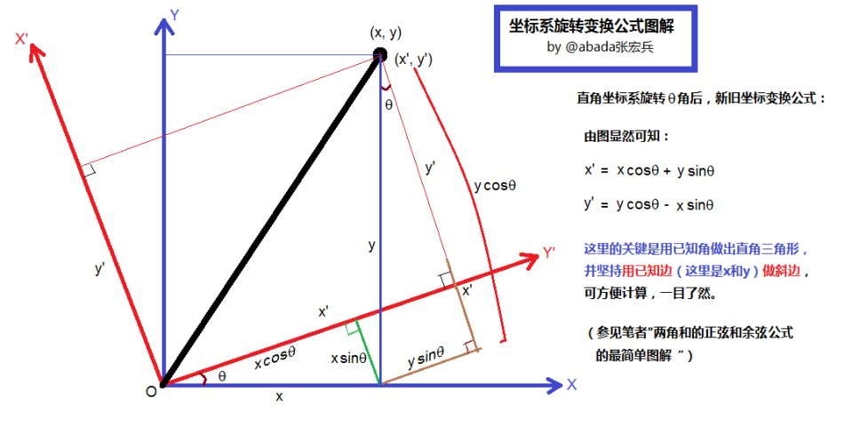

`np.array`（NumPy 数组）**本身不直接提供“旋转任意角度”的高级 API**，但你可以通过矩阵乘法和 `numpy` 提供的线性代数函数实现二维数据的任意角度旋转。

---

### ✅ 一般二维点集的旋转方式（推荐）

如果你的 `X` 是一个形如 `(N, 2)` 的点集（N 个二维坐标），你可以使用如下方法对其旋转：

```python
import numpy as np

def rotate_points(X, angle_rad, center=(0, 0)):
    """
    旋转二维点集 X（形状为 N x 2），以 center 为中心，按角度 angle_rad 旋转（弧度制）
    """
    rotation_matrix = np.array([
        [np.cos(angle_rad), -np.sin(angle_rad)],
        [np.sin(angle_rad),  np.cos(angle_rad)]
    ])
    # 平移到原点再旋转
    X_shifted = X - center
    X_rotated = X_shifted @ rotation_matrix.T
    return X_rotated + center
```

#### 示例：

```python
X = np.array([
    [1, 0],
    [0, 1],
    [-1, 0],
    [0, -1]
])
angle = np.pi / 4  # 旋转 45 度
X_rot = rotate_points(X, angle)
```

---

### 📌 注意

* 这是对点集进行**几何旋转**，不是图像那种“旋转数组”的操作。
* 如果你是想对 **图像做旋转**（比如 `(H, W)` 的矩阵），NumPy 只支持：

  ```python
  np.rot90(arr, k=1)  # 逆时针旋转90度（k次）
  ```

  但 `np.rot90` **仅支持 90°的倍数旋转**，不支持任意角度。

---

### 🎯 总结

| 目标                 | 方法                                   |
| ------------------ | ------------------------------------ |
| 旋转二维点集（任意角度）       | 构造旋转矩阵，自定义函数                         |
| 旋转图像（90/180/270 度） | `np.rot90()`                         |
| 更复杂的图像旋转（任意角度）     | 使用 `scipy.ndimage.rotate` 或 `OpenCV` |


图中展示了一个**正方形点集**在二维平面上顺时针旋转 45°（π/4）的几何意义：



* **蓝色**：原始图形（正方形）；
* **红色虚线**：经过顺时针旋转后的图形；
* 旋转后，图形的每一个点按如下方式映射：

  $$
  \begin{bmatrix}
  x' \\
  y'
  \end{bmatrix}
  =
  \begin{bmatrix}
  \cos(\theta) & \sin(\theta) \\
  -\sin(\theta) & \cos(\theta)
  \end{bmatrix}
  \cdot
  \begin{bmatrix}
  x \\
  y
  \end{bmatrix}
  $$

几何意义上，这表示整个图形以原点为中心做**刚性旋转变换**，保持形状与距离不变，仅**方向发生变化**。

如果你想旋转任意角度的任意图形、围绕其他中心点、或想可视化坐标轴变换，我也可以继续帮你扩展。
