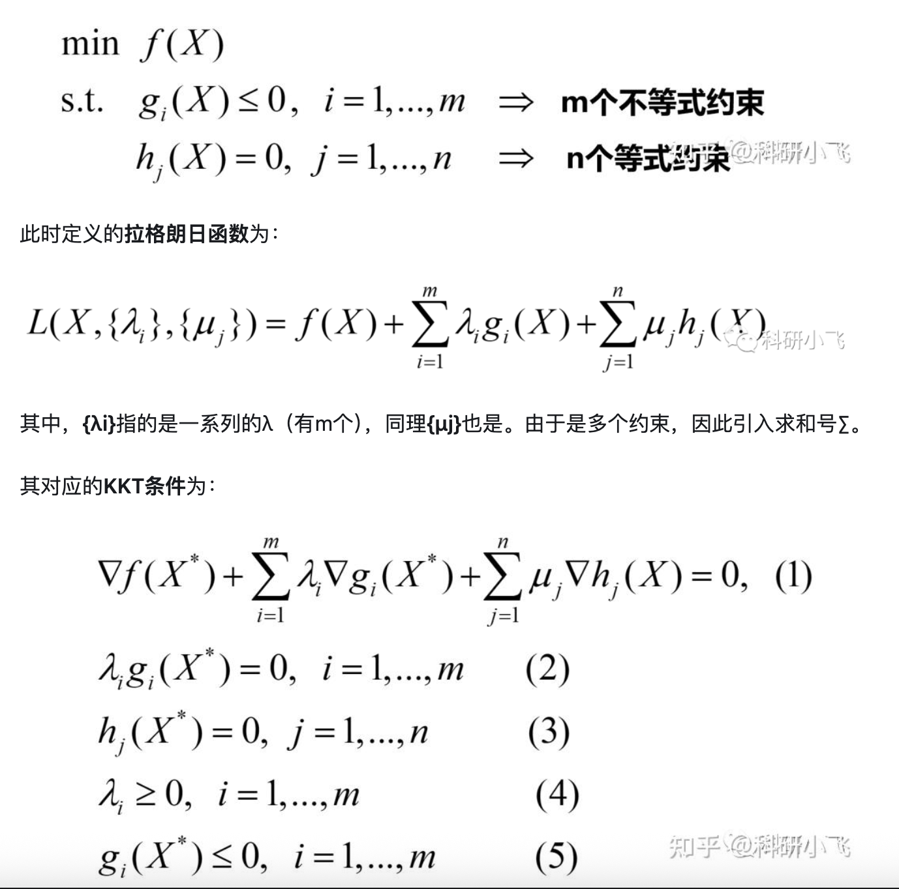
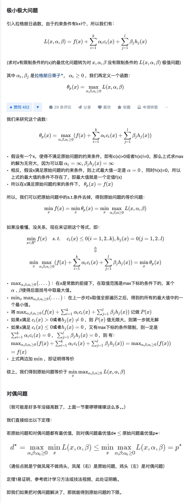

# 拉格朗日乘法的定义、KKT

### 形象理解拉格朗日乘法的概念

#### 相关资料
* [如何理解拉格朗日乘子法？ - 知乎.html](%E5%A6%82%E4%BD%95%E7%90%86%E8%A7%A3%E6%8B%89%E6%A0%BC%E6%9C%97%E6%97%A5%E4%B9%98%E5%AD%90%E6%B3%95%EF%BC%9F%20-%20%E7%9F%A5%E4%B9%8E.html)
* [形象理解拉格朗日乘子法 - 知乎.html](%E5%BD%A2%E8%B1%A1%E7%90%86%E8%A7%A3%E6%8B%89%E6%A0%BC%E6%9C%97%E6%97%A5%E4%B9%98%E5%AD%90%E6%B3%95%20-%20%E7%9F%A5%E4%B9%8E.html)
* [维基百科] https://zh.m.wikipedia.org/wiki/%E6%8B%89%E6%A0%BC%E6%9C%97%E6%97%A5%E4%B9%98%E6%95%B0#%E8%AF%81%E6%98%8E

### KKT理解

* [ KKT条件，原来如此简单 ｜ 理论＋算例实践 - 知乎.html](%20KKT%E6%9D%A1%E4%BB%B6%EF%BC%8C%E5%8E%9F%E6%9D%A5%E5%A6%82%E6%AD%A4%E7%AE%80%E5%8D%95%20%EF%BD%9C%20%E7%90%86%E8%AE%BA%EF%BC%8B%E7%AE%97%E4%BE%8B%E5%AE%9E%E8%B7%B5%20-%20%E7%9F%A5%E4%B9%8E.html)

### 对偶

* [拉格朗日对偶性(Lagrange duality).html](%E6%8B%89%E6%A0%BC%E6%9C%97%E6%97%A5%E5%AF%B9%E5%81%B6%E6%80%A7%28Lagrange%20duality%29.html)
* [对偶问题证明](https://www.cnblogs.com/90zeng/p/Lagrange_duality.html)
* [对偶问题证明](https://zhuanlan.zhihu.com/p/507341964)

---

拉格朗日对偶 (Lagrangian Duality) 是优化理论中的一个核心概念，它提供了一种从原始（Primal）优化问题构造出另一个相关联的对偶（Dual）优化问题的方法。对偶问题通常具有良好的性质（例如，即使原始问题非凸，对偶问题也总是凸的），并且其最优解提供了原始问题最优解的下界。

---

## 拉格朗日对偶的推导过程

我们将从一个标准的约束优化问题（称为**原始问题**）开始，然后逐步推导出其**对偶问题**。

### 1. 原始问题 (Primal Problem)

考虑一个一般的优化问题，我们称之为原始问题 (P)：

**最小化 (Minimize):** $f(x)$
**受限于 (Subject to):**
$g_i(x) \le 0$, for $i = 1, \ldots, m$ (不等式约束)
$h_j(x) = 0$, for $j = 1, \ldots, p$ (等式约束)

其中 $x \in \mathbb{R}^n$ 是优化变量，$f(x)$ 是目标函数，$g_i(x)$ 是不等式约束函数，$h_j(x)$ 是等式约束函数。
我们定义原始问题的最优值为 $p^* = \min \{f(x) \mid g_i(x) \le 0, h_j(x) = 0\}$。

### 2. 构造拉格朗日函数 (Lagrangian Function)

为了处理约束条件，我们引入拉格朗日乘数 (Lagrange Multipliers)。
* 对于每个不等式约束 $g_i(x) \le 0$，引入一个乘数 $\lambda_i \ge 0$。
* 对于每个等式约束 $h_j(x) = 0$，引入一个乘数 $\mu_j \in \mathbb{R}$。

拉格朗日函数 $\mathcal{L}(x, {\lambda}, {\mu})$ 定义为：

$$\mathcal{L}(x, {\lambda}, {\mu}) = f(x) + \sum_{i=1}^m \lambda_i g_i(x) + \sum_{j=1}^p \mu_j h_j(x)$$

其中 ${\lambda} = (\lambda_1, \ldots, \lambda_m)^T$ 和 ${\mu} = (\mu_1, \ldots, \mu_p)^T$ 是拉格朗日乘数向量。

### 3. 定义拉格朗日对偶函数 (Lagrangian Dual Function)

现在，我们定义拉格朗日对偶函数 $g({\lambda}, {\mu})$。这个函数是通过对拉格朗日函数关于 $x$ 求最小值得到的：

$$g({\lambda}, {\mu}) = \inf_{x \in \mathbb{R}^n} \mathcal{L}(x, {\lambda}, {\mu})$$
$$g({\lambda}, {\mu}) = \inf_{x \in \mathbb{R}^n} \left( f(x) + \sum_{i=1}^m \lambda_i g_i(x) + \sum_{j=1}^p \mu_j h_j(x) \right)$$

**重要性质：**
对偶函数 $g({\lambda}, {\mu})$ 总是**凹函数** (concave function)，无论原始问题 $f(x)$ 和 $g_i(x)$ 是否是凸的。这是因为它是仿射函数（关于 ${\lambda}$ 和 ${\mu}$）的逐点下确界。

### 4. 弱对偶性 (Weak Duality)

对偶函数的一个关键性质是它为原始问题提供了**下界**。
对于任何原始可行点 $x$（即满足所有 $g_i(x) \le 0$ 和 $h_j(x) = 0$）和任何满足 $\lambda_i \ge 0$ 的 ${\lambda}$ 和任意 ${\mu}$，我们有：

$$g({\lambda}, {\mu}) \le f(x)$$

**证明：**
由于 $x$ 是原始可行点，我们有 $g_i(x) \le 0$ 和 $h_j(x) = 0$。
又因为我们要求 $\lambda_i \ge 0$，所以 $\lambda_i g_i(x) \le 0$。
同时，$\mu_j h_j(x) = \mu_j \cdot 0 = 0$。

因此，对于任何原始可行点 $x$：
$$\mathcal{L}(x, {\lambda}, {\mu}) = f(x) + \sum_{i=1}^m \lambda_i g_i(x) + \sum_{j=1}^p \mu_j h_j(x) \le f(x) + 0 + 0 = f(x)$$

根据对偶函数的定义 $g({\lambda}, {\mu}) = \inf_{x' \in \mathbb{R}^n} \mathcal{L}(x', {\lambda}, {\mu})$，这意味着 $g({\lambda}, {\mu})$ 是 $\mathcal{L}(x', {\lambda}, {\mu})$ 在所有 $x'$ 上的最小值。因此，对于任何特定的原始可行点 $x$，总有 $g({\lambda}, {\mu}) \le \mathcal{L}(x, {\lambda}, {\mu})$。

结合上述两点，我们得到：
$$g({\lambda}, {\mu}) \le \mathcal{L}(x, {\lambda}, {\mu}) \le f(x)$$
所以，$g({\lambda}, {\mu}) \le f(x)$。

这意味着，对偶函数在满足 $\lambda_i \ge 0$ 的条件下，为原始问题的最优值 $p^*$ 提供了一个下界：
$$g({\lambda}, {\mu}) \le p^*$$

### 5. 构造对偶问题 (Dual Problem)

弱对偶性告诉我们，对偶函数的值总是原始问题最优值的下界。为了找到最好的下界，我们自然会想到最大化这个下界。这就是对偶问题 (D) 的定义：

**最大化 (Maximize):** $g({\lambda}, {\mu})$
**受限于 (Subject to):** $\lambda_i \ge 0$, for $i = 1, \ldots, m$

我们定义对偶问题的最优值为 $d^* = \max \{g({\lambda}, {\mu}) \mid \lambda_i \ge 0\}$.

根据弱对偶性，我们总是有 $d^* \le p^*$。这个差值 $p^* - d^*$ 称为**对偶间隙 (duality gap)**。

### 6. 强对偶性 (Strong Duality)

在某些条件下（例如，当原始问题是凸优化问题且满足 Slater 条件时），对偶间隙为零，即 $d^* = p^*$。这被称为**强对偶性**。

强对偶性非常重要，因为它意味着我们可以通过求解对偶问题来找到原始问题的最优解。

### 总结推导流程

1.  **定义原始问题 (P):** 最小化 $f(x)$ 受到不等式和等式约束。
2.  **构造拉格朗日函数 $\mathcal{L}(x, {\lambda}, {\mu})$:** 将约束项通过拉格朗日乘数加入到目标函数中。
3.  **定义对偶函数 $g({\lambda}, {\mu})$:** 对拉格朗日函数关于 $x$ 求下确界（最小值）。
4.  **证明弱对偶性 $g({\lambda}, {\mu}) \le f(x)$:** 表明对偶函数为原始问题提供下界。
5.  **定义对偶问题 (D):** 最大化对偶函数 $g({\lambda}, {\mu})$，受限于 $\lambda_i \ge 0$。

通过这个推导过程，我们从一个有约束的原始问题，转化为了一个无约束（或仅有简单非负约束）的对偶问题，并且对偶问题总是凸的，这使得它在计算上通常更容易求解。

---

你这段话精彩地概括了从原始优化问题（带有约束）过渡到**拉格朗日对偶问题**的核心思想，以及引入 ${\lambda} \ge 0$ 和 ${\eta}$ 的作用。

你所描述的正是**原始问题与拉格朗日函数的联系**，以及如何利用**鞍点问题** (Saddle Point Problem) 的概念来推导出对偶问题。让我们一步步来解析它。

---

## 从原始问题到拉格朗日对偶的“桥梁”

我们再次回顾原始的约束优化问题 (Primal Problem)：

**最小化 (Minimize):** $f(x)$
**受限于 (Subject to):**
$g_i(x) \le 0$, for $i = 1, \ldots, m$ (不等式约束)
$h_j(x) = 0$, for $j = 1, \ldots, p$ (等式约束)

它的**广义拉格朗日函数**是：

$$L(x, {\lambda}, {\eta}) = f(x) + \sum_{i=1}^m \lambda_i g_i(x) + \sum_{j=1}^p \eta_j h_j(x)$$

其中，${\lambda} = (\lambda_1, \ldots, \lambda_m)^T$ 是对应不等式约束的拉格朗日乘数，且要求 $\lambda_i \ge 0$；${\eta} = (\eta_1, \ldots, \eta_p)^T$ 是对应等式约束的拉格朗日乘数，$\eta_j \in \mathbb{R}$。

---

## 构造 $\theta_P(x)$：将约束“融入”目标函数

你定义了一个函数 $\theta_P(x)$：

$$\theta_P(x) = \max_{{\lambda} \ge 0, {\eta}} L(x, {\lambda}, {\eta})$$

这个 $\theta_P(x)$ 是理解拉格朗日对偶的关键一步。让我们来分析它：

1.  **当 $x$ 满足原始约束时：**
    * 如果 $g_i(x) \le 0$，且我们要求 $\lambda_i \ge 0$，那么 $\lambda_i g_i(x) \le 0$。为了最大化 $L(x, {\lambda}, {\eta})$，我们应该选择 $\lambda_i = 0$。
    * 如果 $h_j(x) = 0$，那么 $\eta_j h_j(x) = 0$，无论 $\eta_j$ 取何值。
    * 因此，当 $x$ 满足所有原始约束时，对于最大的 $L(x, {\lambda}, {\eta})$，我们只能得到 $f(x) + 0 + 0 = f(x)$。
    * 也就是说，**如果 $x$ 是原始可行解，则 $\theta_P(x) = f(x)$。**

2.  **当 $x$ 不满足原始约束时：**
    * **如果存在某个 $g_i(x) > 0$：** 由于我们要求 $\lambda_i \ge 0$，我们可以选择让对应的 $\lambda_i \to +\infty$。这样，$\lambda_i g_i(x)$ 就会趋向于 $+\infty$，导致整个 $L(x, {\lambda}, {\eta})$ 趋向于 $+\infty$。
    * **如果存在某个 $h_j(x) \ne 0$：** 无论 $h_j(x)$ 是正还是负，我们都可以选择让对应的 $\eta_j$ 趋向于 $+\infty$ 或 $-\infty$，使得 $\eta_j h_j(x)$ 趋向于 $+\infty$，同样导致整个 $L(x, {\lambda}, {\eta})$ 趋向于 $+\infty$。
    * 因此，**如果 $x$ 不满足原始约束（即 $x$ 是原始不可行解），则 $\theta_P(x) = +\infty$。**

---

## 原始问题转化为无约束优化

综合以上两点，我们发现 $\theta_P(x)$ 有一个非常重要的特性：

$$\theta_P(x) = \begin{cases} f(x) & \text{如果 } x \text{ 满足所有原始约束} \\ +\infty & \text{如果 } x \text{ 不满足原始约束} \end{cases}$$

这样，原始问题“**最小化 $f(x)$ 且满足约束**”就等价于“**最小化 $\theta_P(x)$ 且没有显式约束**”。

$$\min_x f(x) \quad \text{subject to original constraints}$$**等价于**$$\min_x \theta_P(x)$$**等价于**$$\min_x \left( \max_{{\lambda} \ge 0, {\eta}} L(x, {\lambda}, {\eta}) \right)$$

这就是你提到的：

$$\min_x L(x, {\lambda}, {\eta}) = \min_x \theta_P(x) = \min_x \max_{{\lambda} \ge 0, {\eta}} L(x, {\lambda}, {\eta})$$

---

## 为什么这样做能简化计算？

表面上看，`min max` 的形式似乎更复杂了。但是，这种转化是通向**对偶问题**的关键一步，而对偶问题往往有更好的计算特性：

1.  **凸性：** 对偶问题（最大化 $g({\lambda}, {\eta})$）总是**凸优化问题**，即使原始问题是非凸的。凸优化问题有许多成熟高效的算法可以求解，并且局部最优解就是全局最优解。
2.  **易于求导：** 在某些情况下，原始问题中的约束使得直接求导困难。而通过拉格朗日对偶，我们可以得到一个可能更容易求导的无约束或简单约束形式。
3.  **对偶变量的物理意义：** 拉格朗日乘数（${\lambda}$ 和 ${\eta}$）通常具有重要的经济学或物理学意义，例如在 SVM 中，$\lambda_i$ 对应于支持向量，反映了约束的“活跃程度”。
4.  **提供下界：** 对偶问题的最优值 $d^*$ 总是原始问题最优值 $p^*$ 的下界（弱对偶性）。在满足某些条件（如凸性和 Slater 条件）时，它们相等（强对偶性），这意味着我们可以通过求解对偶问题来间接求解原始问题。

你正确地指出了拉格朗日乘数法将约束问题转化为无约束问题的方法。而通过引入 `max` 运算，我们巧妙地将约束的“惩罚”机制融入到目标函数本身，使得不满足约束的解得到无限大的“惩罚”，从而在最小化时自然被排除在外。这正是拉格朗日对偶理论的精妙之处。

